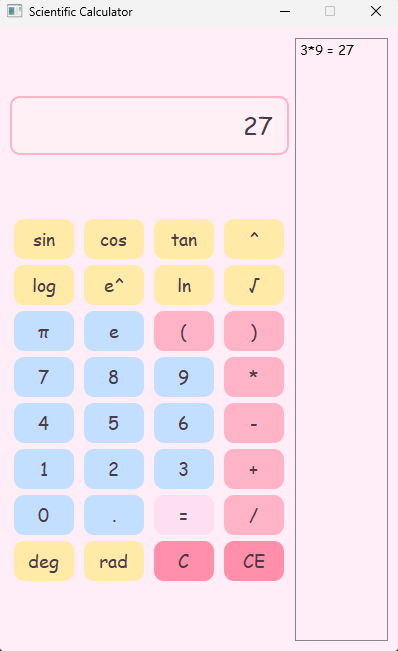

## Scientific Calculator (GUI)

A scientific calculator with a graphical user interface (GUI) built using Python and PyQt5.  
This calculator supports basic arithmetic as well as advanced operations including trigonometric functions, logarithms, and square roots.  
The calculator also supports decimal numbers and parentheses for grouped calculations while also displaying an active history of all
calculations done.

---

## Features

- Interactive GUI built with PyQt5  
- Basic arithmetic: addition, subtraction, multiplication, division  
- Advanced operations: sine, cosine, tangent, logarithm, square root  
- Parentheses and decimal number support  
- Clear and user-friendly layout 
- Active History

---

## Project Structure

```text
.                
│  
├── src/  
│   ├── calculatorGUI.py       # GUI implementation  
│   └── engine.py     # Core evaluation logic  
│  
├── images/                     # Folder for screenshots used 
│   ├── equation.png
│   └── result.png
│
├── requirements.txt            # Python dependencies  
├── README.md                   # Project documentation  
├── LICENSE                     # License file  
└── .gitignore                  # Files ignored by Git  
```

---

## Requirements

- Python 3.8+  
- PyQt5  

Install dependencies with:

```bash
pip install -r requirements.txt
```

---

## How to Run

1. Clone the repository:

```bash
git clone https://github.com/devinhien/scientific-calculator.git
cd scientific-calculator
```

2. Install dependencies:

```bash
pip install -r requirements.txt
```


3. Run the calculator:

```bash
python src/calculatorGUI.py # or use 'python3' if needed
```

---

## Screenshots

### Initial Equation


### Result


---

## License

This project is licensed under the MIT License – see the LICENSE
file for details.
